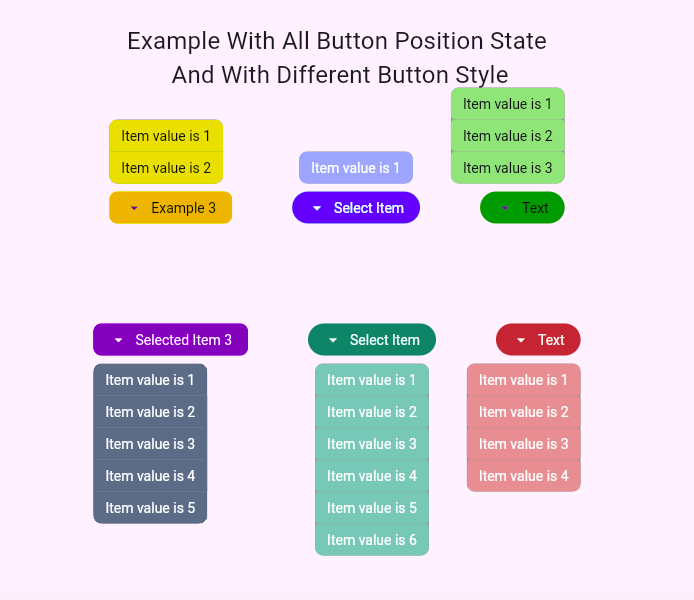

# Basic DropDown Button

<p align="center">
  <a href="https://pub.dev/packages/basic_dropdown_button "></a>
  <a href="https://app.codecov.io/github/DemienIlnutskiy/flutter_basic_dropdown_button"></a>
  <a href="https://github.com/DemienIlnutskiy/flutter_basic_dropdown_button/actions/workflows/generate_code_coverate.yaml"></a>
  <a href="https://github.com/DemienIlnutskiy/flutter_basic_dropdown_button/actions/workflows/ci.yaml">
    
  </a>
</p>

A highly customizable drop-down button widget for Flutter. This package offers two variants—one streamlined for ease-of-use and one with full customization—so you can integrate a stylish, adaptive drop-down button into your app with minimal hassle or with extensive control over every detail.

---

## Preview

Below is a preview of the Custom DropDown Button in action:



---

## Overview

**Custom DropDown Button** provides two distinct implementations:

1. **CustomDropDownButton**  
   A simplified version that exposes only the most essential parameters for quick integration and basic customization.

2. **BasicDropDownButton**  
   A more advanced version offering extensive customization options for both the button and its menu. This version is ideal if you need fine-grained control or want to build your own widget based on our implementation.

---

## Features

### 1. Two Versions for Flexibility

- **CustomDropDownButton**  
  - **Simplified API:** Designed for ease-of-use with most primary parameters preconfigured.
  - **Quick Integration:** Ideal when you want a functional drop-down without specifying many properties.

- **BasicDropDownButton**  
  - **Advanced Customization:** Offers a broader API with many parameters to tweak both the button and menu appearance and behavior.
  - **Custom Widget Development:** Serves as an example for developers who want to create their own highly customizable widgets.

### 2. Automatic Menu Positioning

- **Adaptive Layout:** The widget automatically changes the menu's position based on available screen space.
  - If there isn’t enough space below the button, the menu opens above.
  - Conversely, if space above is limited, it opens below.
- **Enhanced Usability:** This dynamic positioning ensures that the menu is always fully visible, regardless of screen size or orientation.

### 3. Full Customization of Style and Widgets

- **Button & Menu Styling:**  
  - You can change the style or even replace the widget for both the button and the menu.
  - Customize colors, shapes, padding, spacing, and more using Flutter's [ButtonStyle](https://api.flutter.dev/flutter/material/ButtonStyle-class.html) API and other styling parameters.

### 4. Simplified API with CustomDropDownButton

- **Minimal Configuration:**  
  - When using `CustomDropDownButton`, you don’t need to provide an extensive list of parameters—the majority of essential settings are already configured for you.
  - This makes it easier and faster to implement a drop-down button in your projects.

### 5. An Example for Custom Widget Development

- **Learning Resource:**  
  - `CustomDropDownButton` can serve as a practical example of how to build and customize your own widget.
  - You can study its structure and even extend it using the more flexible `BasicDropDownButton` as a foundation.

---

## Example

```dart
CustomDropDownButton<int>(
  buttonStyle: ButtonStyle(
    backgroundColor:
        WidgetStatePropertyAll(Colors.blue[600]),
    padding: WidgetStatePropertyAll(
        const EdgeInsets.symmetric(horizontal: 16, vertical: 12)),
    textStyle: WidgetStatePropertyAll(const TextStyle(
      color: Colors.white,
      fontWeight: FontWeight.w400,
    )),
    shape: WidgetStatePropertyAll(
      RoundedRectangleBorder(
        borderRadius: BorderRadius.circular(20.0),
      ),
    ),
  ),
  buttonText: 'Select Item',
  position: DropDownButtonPosition.bottomCenter,
  buttonIconColor: Colors.black,
  buttonTextStyle: TextStyle(
    color: Colors.white,
  ),
  menuItems: List.generate(
    itemCount,
    (index) => CustomDropDownButtonItem(
      value: index + 1,
      text: 'Item value is ${index + 1}',
      onPressed: () => event(index),
      buttonStyle: ButtonStyle(
          backgroundColor: WidgetStatePropertyAll(Colors.blueGrey),
          textStyle: WidgetStatePropertyAll(const TextStyle(
          color: Colors.black,
          )),
          shape: WidgetStatePropertyAll(
            RoundedRectangleBorder(
                borderRadius: BorderRadius.zero,
            ),
          ),
      ),
      textStyle: TextStyle(
        color: Colors.white,
      ),
    ),
  ),
  menuBorderRadius: BorderRadius.circular(
    8,
  ),
  selectedValue: 1,
)